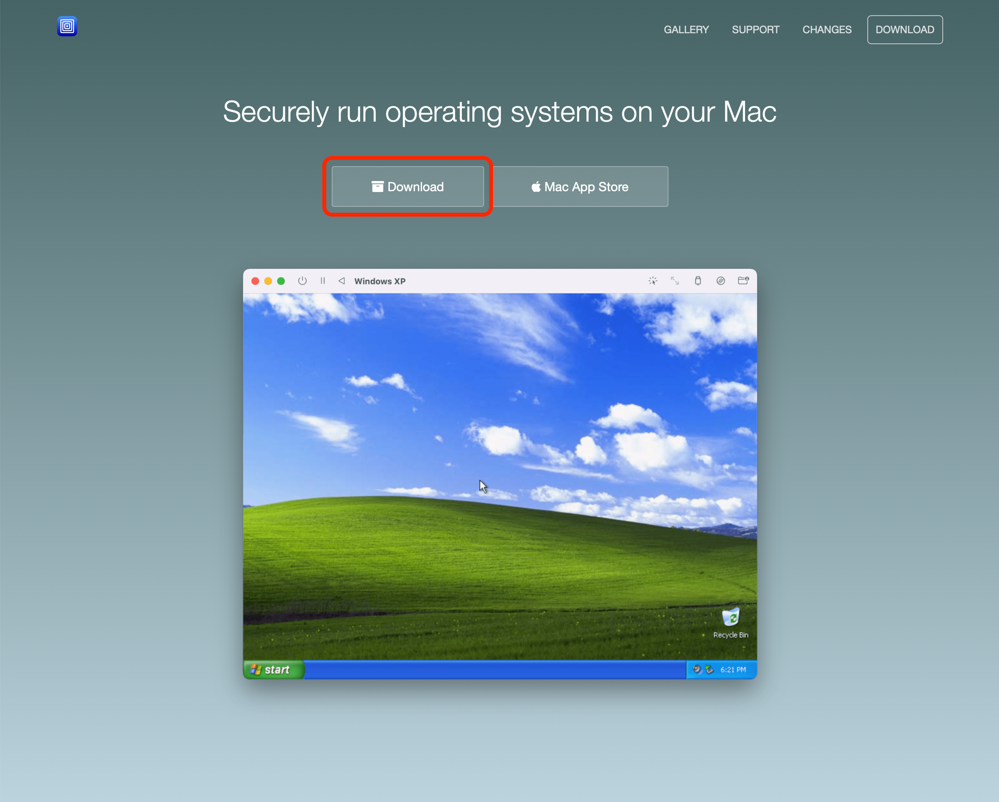
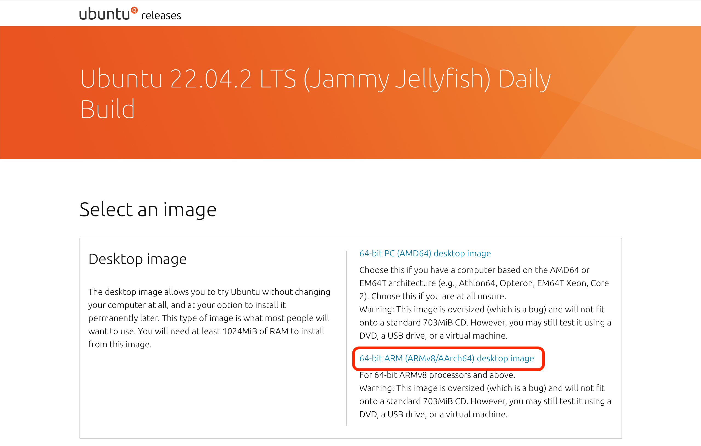
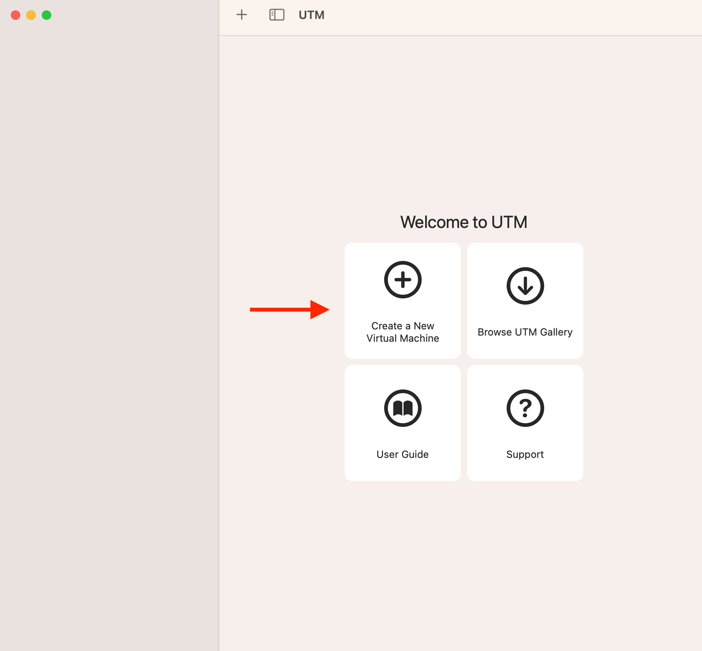
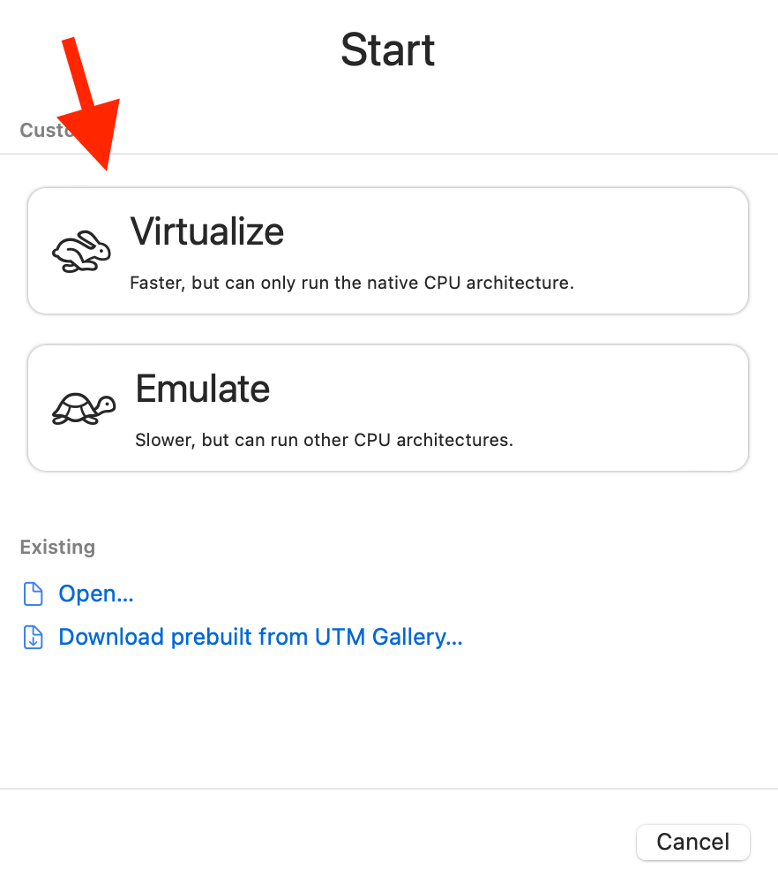
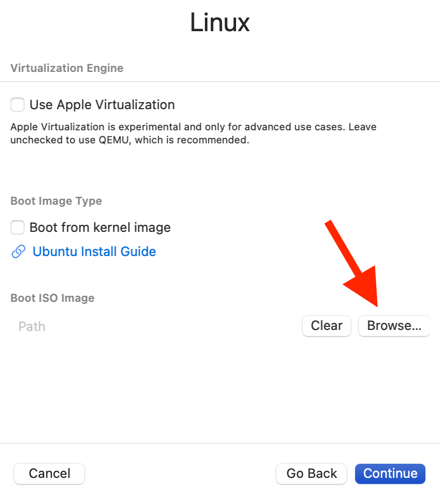
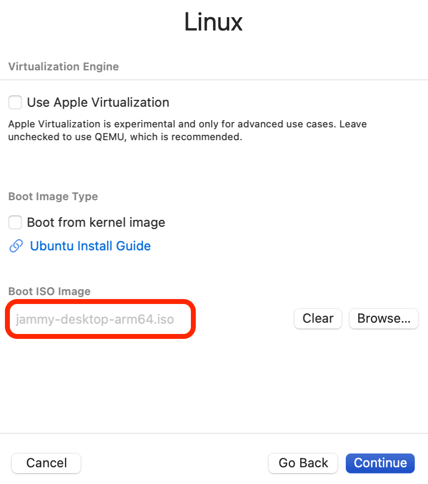
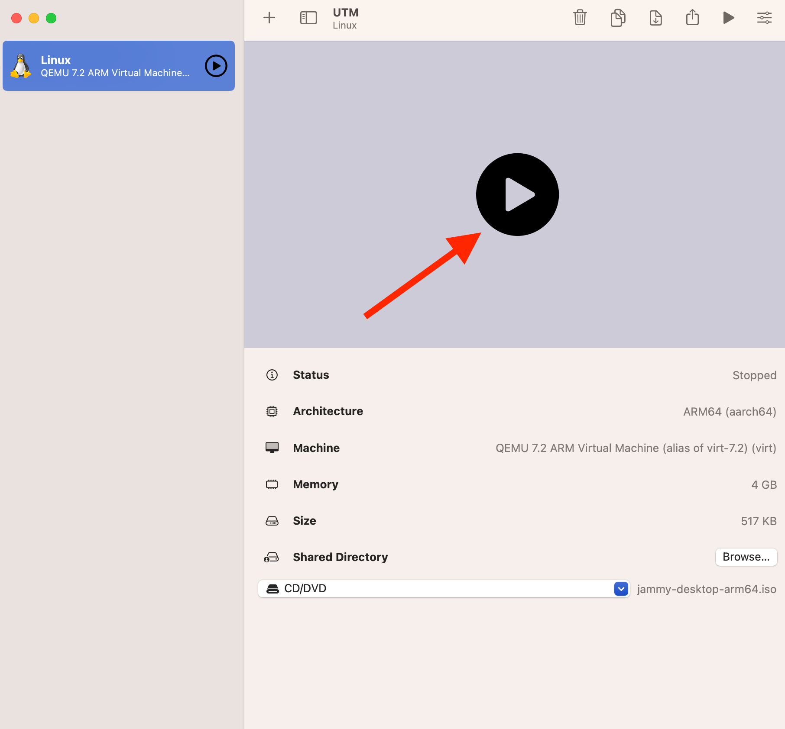
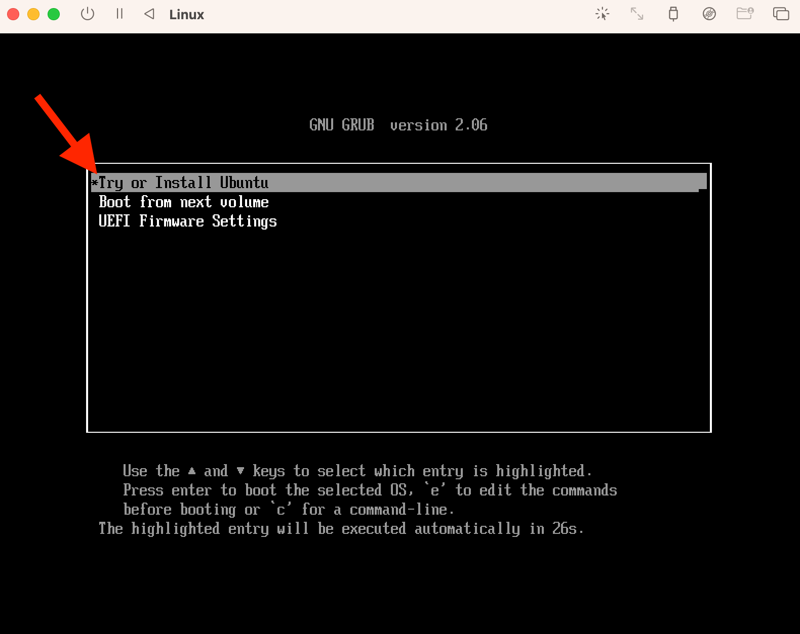
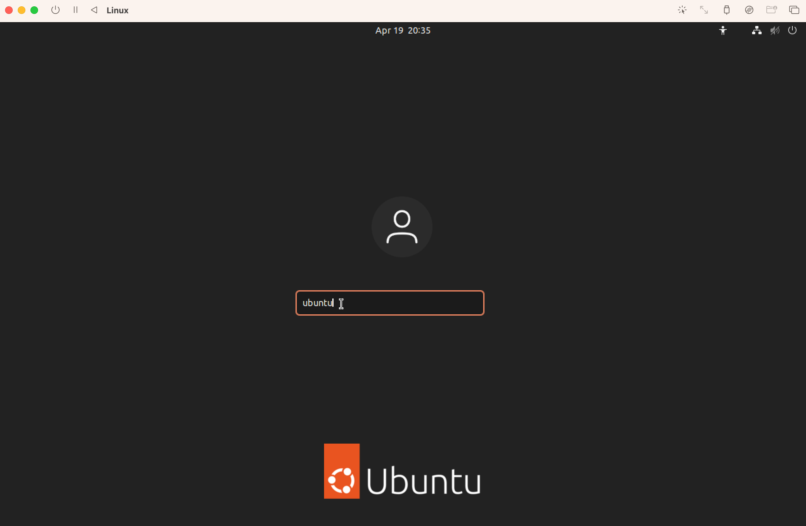
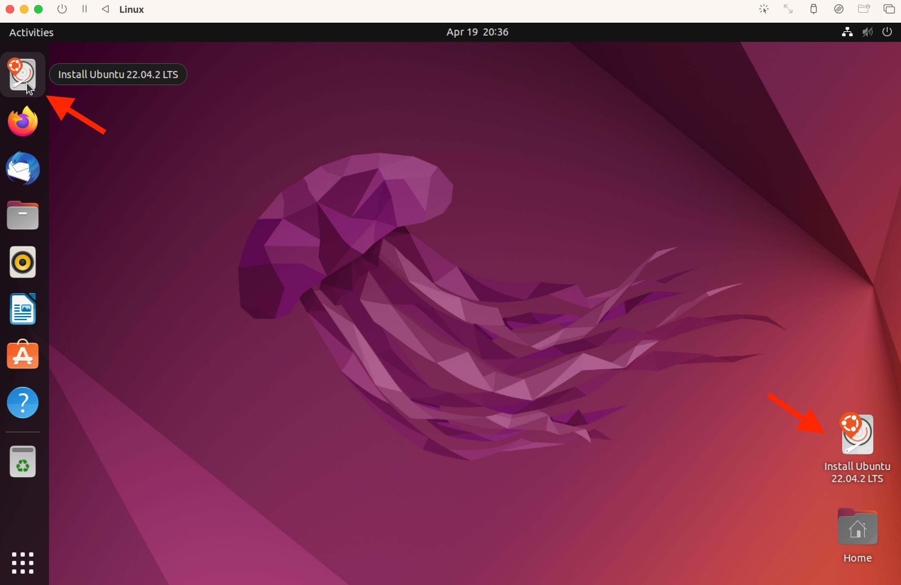

## Apple Silicon Ubuntu Installation with UTM

### Step 1: Download UTM

[UTM Download Page](https://mac.getutm.app)

---

---

### Step 2: Download Ubuntu for ARM

[Ubuntu Download Page](https://cdimages.ubuntu.com/jammy/daily-live/pending/)

---

---

### Step 3: Install UTM

UTM is downloaded as a disk image. Double click the disk image and drag the icon into the Applications folder on your Mac.

---

### Step 4: Configure Virtual Machine

Open UTM and create a new virtual machine:

---

---

Click **Virtualize**

---

---

Click **Linux**, then click **Browse...** to select the the `jammy-desktop-arm64.iso` disk image file.

---

---

After you have selected the correct disk image file, it should look like the screenshot below.

---

---

No other changes are required, so at this point you'll click **Continue** 4 times, followed by **Save**.

You're virtual machine is now configured!

### Step 5: Start the Virtual Machine and install Ubuntu

Click on the **Start** button, as shown in the screenshot below.

---

---

Make sure to select **Try or Install Ubuntu**. If you don't do anything, it will be selected automatically.

---

When the login screen appears, type **ubuntu** and then press enter on your keyboard.

---

---

Once the desktop loads, click the **Install Ubuntu** icon.

---

---
